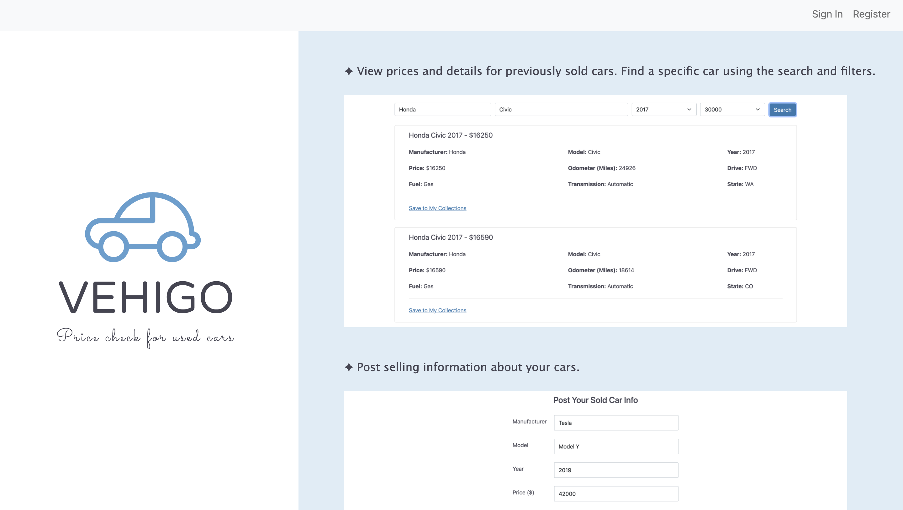
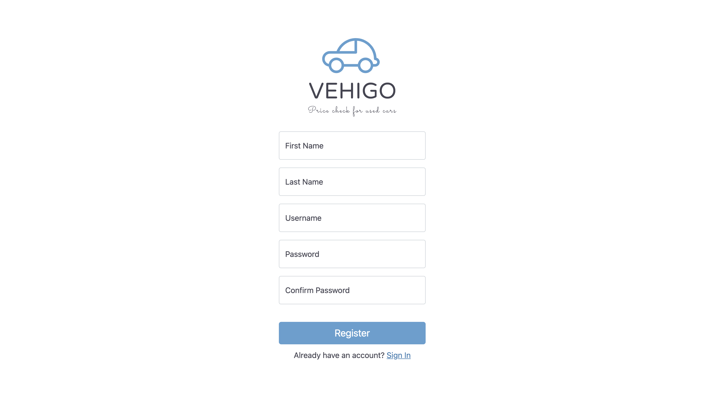

### App Name: VehiGo

A website to help user check the prices of used cars.  
https://vehigo.herokuapp.com/

#### App Features:

- Users can view the prices and other details of previous sold used cars by searching car names or filtering car info (like max mileage).
- Users can save useful information to their collections for future reference.
- Users can post information about their own sold cars and manage what they posted in their home page.

### Author:

Xingyu Lai: https://xingyu711.github.io/  
Hao Yin: https://pages.github.ccs.neu.edu/calvinyin/calvinyin.github.io/

### Screenshot:

1. Landing page that shows main features of our app.
       
2. Resgister to use our app.
       
3. View prices and details for previously sold cars. Find a specific car using the search and filters.
       
4. Post selling information about your cars.
       
5. Gallery page with photos of my dogs and my life
   

### Technologies used:

- MongoDB
- Node.js & Express
- JavaScript
- HTML
- CSS
- Bootstrap

### How to build the project:

1. Install node.js on your computer: https://nodejs.org/en/download/
2. Clone the repository
3. Create a `.env` file under this folder, and add your mongoDB username and password in this formart `DB_USER = yourUsername DB_PASSWORD = yourPassword`
4. Run `npm install` in terminal to install all the dependencies
5. Run `npm run dev` to start the server and open the project in browser

### Course:

- CS5610 Web Development Spring 2021
- Northeastern University
- Link to class homepage: https://johnguerra.co/classes/webDevelopment_spring_2021/

#### Project Objective:

Applying the concepts learned in class and build a basic backend application with Node + Express + Mongo and HTML5
